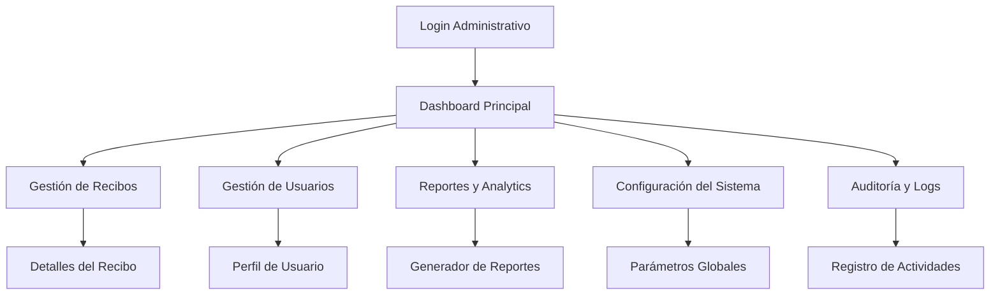

# Documento de Requerimientos del Producto - Panel Administrativo de Recibos Digitales

## 1. Descripción General del Producto

Panel administrativo web para la gestión y supervisión de recibos digitales generados por la aplicación móvil "MisComprobantes". Sistema diseñado exclusivamente para administradores autorizados que requieren acceso completo a la información de recibos digitales, estadísticas de uso y gestión de usuarios.

El panel proporcionará una interfaz formal y profesional para el control administrativo completo del ecosistema de recibos digitales, permitiendo supervisión en tiempo real, generación de reportes y configuración del sistema.

## 2. Características Principales

### 2.1 Roles de Usuario

| Rol | Método de Registro | Permisos Principales |
|-----|-------------------|---------------------|
| Super Administrador | Acceso directo del sistema | Acceso completo: gestión de usuarios, configuración del sistema, reportes avanzados |
| Administrador | Invitación por Super Admin | Gestión de recibos, reportes básicos, supervisión de usuarios |
| Auditor | Invitación por Admin | Solo lectura: visualización de recibos y reportes |

### 2.2 Módulos de Funcionalidad

Nuestro panel administrativo consta de las siguientes páginas principales:

1. **Dashboard Principal**: métricas en tiempo real, gráficos de estadísticas, resumen de actividad reciente.
2. **Gestión de Recibos**: listado completo, filtros avanzados, detalles individuales, exportación masiva.
3. **Gestión de Usuarios**: administración de usuarios de la app móvil, estados de cuenta, historial de actividad.
4. **Reportes y Analytics**: generación de reportes personalizados, análisis de tendencias, exportación de datos.
5. **Configuración del Sistema**: parámetros globales, configuración de notificaciones, gestión de plantillas.
6. **Auditoría y Logs**: registro de actividades, trazabilidad de cambios, logs de seguridad.

### 2.3 Detalles de Páginas

| Nombre de Página | Nombre del Módulo | Descripción de Funcionalidad |
|------------------|-------------------|------------------------------|
| Dashboard Principal | Panel de Métricas | Mostrar estadísticas en tiempo real, gráficos interactivos, alertas del sistema, resumen de actividad diaria |
| Dashboard Principal | Navegación Rápida | Accesos directos a funciones principales, notificaciones pendientes, estado del sistema |
| Gestión de Recibos | Lista de Recibos | Visualizar todos los recibos con paginación, filtros por fecha/usuario/estado, búsqueda avanzada |
| Gestión de Recibos | Detalles del Recibo | Mostrar información completa del recibo, historial de cambios, opciones de descarga |
| Gestión de Recibos | Exportación Masiva | Seleccionar múltiples recibos, configurar formato de exportación, generar archivos ZIP |
| Gestión de Usuarios | Lista de Usuarios | Administrar usuarios de la app móvil, estados de cuenta, filtros y búsqueda |
| Gestión de Usuarios | Perfil de Usuario | Detalles completos del usuario, historial de recibos, configuraciones de cuenta |
| Reportes y Analytics | Generador de Reportes | Crear reportes personalizados, seleccionar métricas, configurar períodos de tiempo |
| Reportes y Analytics | Dashboard Analítico | Gráficos interactivos, tendencias de uso, análisis comparativo |
| Configuración del Sistema | Parámetros Globales | Configurar límites del sistema, políticas de retención, configuraciones de seguridad |
| Configuración del Sistema | Gestión de Plantillas | Administrar plantillas de recibos, personalización de formatos |
| Auditoría y Logs | Registro de Actividades | Visualizar logs del sistema, filtros por usuario/acción/fecha |
| Auditoría y Logs | Trazabilidad | Seguimiento de cambios en recibos, historial de modificaciones |

## 3. Proceso Principal

**Flujo de Administrador Principal:**
1. Autenticación segura con credenciales administrativas
2. Acceso al dashboard principal con métricas en tiempo real
3. Navegación a gestión de recibos para supervisión diaria
4. Revisión de reportes y analytics para toma de decisiones
5. Configuración del sistema según necesidades operativas
6. Auditoría de actividades para control de seguridad

**Flujo de Auditor:**
1. Autenticación con credenciales de solo lectura
2. Acceso limitado al dashboard de métricas
3. Consulta de recibos sin capacidad de modificación
4. Generación de reportes básicos
5. Revisión de logs de auditoría

## 4. Diseño de Interfaz de Usuario

### 4.1 Estilo de Diseño

- **Colores Primarios**: Azul corporativo (#1E40AF), Gris profesional (#374151)
- **Colores Secundarios**: Verde éxito (#059669), Rojo alerta (#DC2626), Amarillo advertencia (#D97706)
- **Estilo de Botones**: Redondeados con sombras sutiles, efectos hover profesionales
- **Tipografía**: Inter o Roboto, tamaños 14px-16px para texto, 18px-24px para títulos
- **Estilo de Layout**: Diseño de tarjetas con espaciado generoso, navegación lateral fija
- **Iconografía**: Iconos de Element Plus con estilo minimalista y profesional

### 4.2 Resumen de Diseño de Páginas

| Nombre de Página | Nombre del Módulo | Elementos de UI |
|------------------|-------------------|----------------|
| Dashboard Principal | Panel de Métricas | Tarjetas de estadísticas con iconos, gráficos Chart.js, colores azul/verde para métricas positivas |
| Dashboard Principal | Navegación Rápida | Sidebar fijo con iconos Element Plus, breadcrumbs, notificaciones badge |
| Gestión de Recibos | Lista de Recibos | Tabla El-Table con paginación, filtros El-Select, botones de acción con colores diferenciados |
| Gestión de Recibos | Detalles del Recibo | Modal El-Dialog, layout de dos columnas, botones de descarga con iconos |
| Gestión de Usuarios | Lista de Usuarios | Tabla responsive, avatares circulares, badges de estado con colores semánticos |
| Reportes y Analytics | Dashboard Analítico | Gráficos interactivos, filtros de fecha El-DatePicker, cards con métricas destacadas |
| Configuración del Sistema | Parámetros Globales | Formularios El-Form con validación, switches El-Switch, layout en pestañas |
| Auditoría y Logs | Registro de Actividades | Timeline vertical, filtros avanzados, tabla con scroll virtual para rendimiento |

### 4.3 Responsividad

Diseño desktop-first con adaptación móvil completa. Navegación lateral se convierte en drawer en dispositivos móviles. Tablas se adaptan con scroll horizontal y vista de tarjetas en pantallas pequeñas. Optimización táctil para tablets con botones de tamaño adecuado.