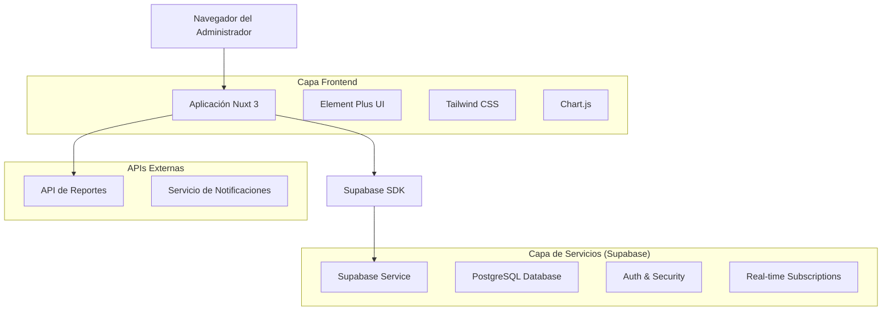
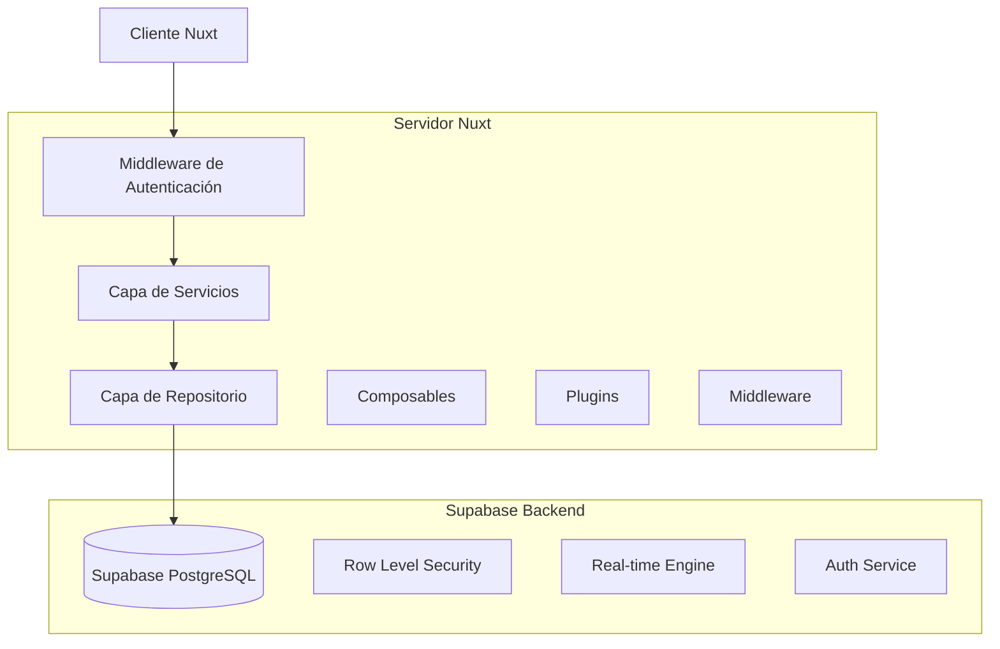
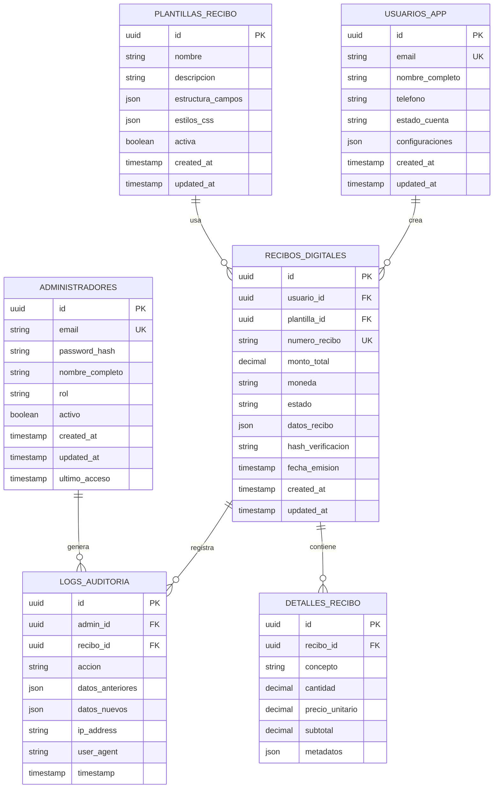

# Documento de Arquitectura Técnica - Panel Administrativo de Recibos Digitales

## 1. Diseño de Arquitectura



## 2. Descripción de Tecnologías

- **Frontend**: Nuxt 3 + Vue 3 Composition API + TypeScript
- **UI Framework**: Element Plus + Tailwind CSS
- **Gráficos**: Chart.js + vue-chartjs
- **Backend**: Supabase (PostgreSQL + Auth + Real-time)
- **Autenticación**: Supabase Auth con Row Level Security
- **Estado**: Pinia para gestión de estado global
- **Build Tool**: Vite + Nuxt 3

## 3. Definiciones de Rutas

| Ruta | Propósito |
|------|----------|
| /login | Página de autenticación para administradores |
| /dashboard | Dashboard principal con métricas y navegación |
| /recibos | Gestión completa de recibos digitales |
| /recibos/[id] | Detalles específicos de un recibo |
| /usuarios | Administración de usuarios de la app móvil |
| /usuarios/[id] | Perfil detallado de usuario |
| /reportes | Generador de reportes y analytics |
| /reportes/analytics | Dashboard analítico con gráficos |
| /configuracion | Configuración del sistema y parámetros |
| /auditoria | Logs de auditoría y trazabilidad |
| /perfil | Perfil del administrador actual |

## 4. Definiciones de API

### 4.1 APIs Principales

**Autenticación de Administradores**
```
POST /auth/v1/token
```

Request:
| Nombre Parámetro | Tipo Parámetro | Requerido | Descripción |
|------------------|----------------|-----------|-------------|
| email | string | true | Email del administrador |
| password | string | true | Contraseña (encriptada) |
| role | string | true | Rol administrativo (admin, super_admin, auditor) |

Response:
| Nombre Parámetro | Tipo Parámetro | Descripción |
|------------------|----------------|-------------|
| access_token | string | Token JWT para autenticación |
| refresh_token | string | Token para renovación |
| user | object | Datos del administrador |
| expires_in | number | Tiempo de expiración en segundos |

Ejemplo:
```json
{
  "email": "admin@miscomprobantes.com",
  "password": "SecurePass123!",
  "role": "admin"
}
```

**Gestión de Recibos**
```
GET /rest/v1/recibos_digitales
```

Request:
| Nombre Parámetro | Tipo Parámetro | Requerido | Descripción |
|------------------|----------------|-----------|-------------|
| limit | number | false | Límite de resultados (default: 50) |
| offset | number | false | Offset para paginación |
| fecha_inicio | string | false | Filtro por fecha inicio (ISO 8601) |
| fecha_fin | string | false | Filtro por fecha fin (ISO 8601) |
| usuario_id | string | false | Filtro por ID de usuario |
| estado | string | false | Filtro por estado (activo, cancelado, pendiente) |

Response:
| Nombre Parámetro | Tipo Parámetro | Descripción |
|------------------|----------------|-------------|
| data | array | Lista de recibos digitales |
| count | number | Total de registros |
| has_more | boolean | Indica si hay más páginas |

**Reportes y Analytics**
```
GET /rest/v1/rpc/generar_reporte_recibos
```

Request:
| Nombre Parámetro | Tipo Parámetro | Requerido | Descripción |
|------------------|----------------|-----------|-------------|
| tipo_reporte | string | true | Tipo (diario, semanal, mensual, personalizado) |
| fecha_inicio | string | true | Fecha de inicio del reporte |
| fecha_fin | string | true | Fecha de fin del reporte |
| formato | string | false | Formato de salida (json, csv, pdf) |

Response:
| Nombre Parámetro | Tipo Parámetro | Descripción |
|------------------|----------------|-------------|
| total_recibos | number | Total de recibos en el período |
| ingresos_totales | number | Suma total de ingresos |
| usuarios_activos | number | Usuarios que generaron recibos |
| tendencias | object | Datos para gráficos de tendencias |

## 5. Diagrama de Arquitectura del Servidor



## 6. Modelo de Datos

### 6.1 Definición del Modelo de Datos



### 6.2 Lenguaje de Definición de Datos

**Tabla de Administradores (administradores)**
```sql
-- Crear tabla
CREATE TABLE administradores (
    id UUID PRIMARY KEY DEFAULT gen_random_uuid(),
    email VARCHAR(255) UNIQUE NOT NULL,
    password_hash VARCHAR(255) NOT NULL,
    nombre_completo VARCHAR(200) NOT NULL,
    rol VARCHAR(50) DEFAULT 'admin' CHECK (rol IN ('super_admin', 'admin', 'auditor')),
    activo BOOLEAN DEFAULT true,
    created_at TIMESTAMP WITH TIME ZONE DEFAULT NOW(),
    updated_at TIMESTAMP WITH TIME ZONE DEFAULT NOW(),
    ultimo_acceso TIMESTAMP WITH TIME ZONE
);

-- Crear índices
CREATE INDEX idx_administradores_email ON administradores(email);
CREATE INDEX idx_administradores_rol ON administradores(rol);
CREATE INDEX idx_administradores_activo ON administradores(activo);

-- Políticas RLS
ALTER TABLE administradores ENABLE ROW LEVEL SECURITY;
GRANT SELECT ON administradores TO authenticated;
GRANT ALL PRIVILEGES ON administradores TO service_role;
```

**Tabla de Usuarios de App (usuarios_app)**
```sql
-- Crear tabla
CREATE TABLE usuarios_app (
    id UUID PRIMARY KEY DEFAULT gen_random_uuid(),
    email VARCHAR(255) UNIQUE NOT NULL,
    nombre_completo VARCHAR(200) NOT NULL,
    telefono VARCHAR(20),
    estado_cuenta VARCHAR(50) DEFAULT 'activo' CHECK (estado_cuenta IN ('activo', 'suspendido', 'inactivo')),
    configuraciones JSONB DEFAULT '{}',
    created_at TIMESTAMP WITH TIME ZONE DEFAULT NOW(),
    updated_at TIMESTAMP WITH TIME ZONE DEFAULT NOW()
);

-- Crear índices
CREATE INDEX idx_usuarios_app_email ON usuarios_app(email);
CREATE INDEX idx_usuarios_app_estado ON usuarios_app(estado_cuenta);
CREATE INDEX idx_usuarios_app_created_at ON usuarios_app(created_at DESC);

-- Políticas RLS
ALTER TABLE usuarios_app ENABLE ROW LEVEL SECURITY;
GRANT SELECT ON usuarios_app TO authenticated;
```

**Tabla de Recibos Digitales (recibos_digitales)**
```sql
-- Crear tabla
CREATE TABLE recibos_digitales (
    id UUID PRIMARY KEY DEFAULT gen_random_uuid(),
    usuario_id UUID REFERENCES usuarios_app(id) ON DELETE CASCADE,
    plantilla_id UUID REFERENCES plantillas_recibo(id),
    numero_recibo VARCHAR(100) UNIQUE NOT NULL,
    monto_total DECIMAL(12,2) NOT NULL,
    moneda VARCHAR(3) DEFAULT 'MXN',
    estado VARCHAR(50) DEFAULT 'activo' CHECK (estado IN ('activo', 'cancelado', 'pendiente')),
    datos_recibo JSONB NOT NULL,
    hash_verificacion VARCHAR(255) NOT NULL,
    fecha_emision TIMESTAMP WITH TIME ZONE DEFAULT NOW(),
    created_at TIMESTAMP WITH TIME ZONE DEFAULT NOW(),
    updated_at TIMESTAMP WITH TIME ZONE DEFAULT NOW()
);

-- Crear índices
CREATE INDEX idx_recibos_usuario_id ON recibos_digitales(usuario_id);
CREATE INDEX idx_recibos_numero ON recibos_digitales(numero_recibo);
CREATE INDEX idx_recibos_fecha_emision ON recibos_digitales(fecha_emision DESC);
CREATE INDEX idx_recibos_estado ON recibos_digitales(estado);
CREATE INDEX idx_recibos_monto ON recibos_digitales(monto_total);

-- Políticas RLS
ALTER TABLE recibos_digitales ENABLE ROW LEVEL SECURITY;
GRANT SELECT ON recibos_digitales TO authenticated;
```

**Tabla de Logs de Auditoría (logs_auditoria)**
```sql
-- Crear tabla
CREATE TABLE logs_auditoria (
    id UUID PRIMARY KEY DEFAULT gen_random_uuid(),
    admin_id UUID REFERENCES administradores(id),
    recibo_id UUID REFERENCES recibos_digitales(id),
    accion VARCHAR(100) NOT NULL,
    datos_anteriores JSONB,
    datos_nuevos JSONB,
    ip_address INET,
    user_agent TEXT,
    timestamp TIMESTAMP WITH TIME ZONE DEFAULT NOW()
);

-- Crear índices
CREATE INDEX idx_logs_admin_id ON logs_auditoria(admin_id);
CREATE INDEX idx_logs_recibo_id ON logs_auditoria(recibo_id);
CREATE INDEX idx_logs_timestamp ON logs_auditoria(timestamp DESC);
CREATE INDEX idx_logs_accion ON logs_auditoria(accion);

-- Políticas RLS
ALTER TABLE logs_auditoria ENABLE ROW LEVEL SECURITY;
GRANT SELECT ON logs_auditoria TO authenticated;

-- Datos iniciales
INSERT INTO administradores (email, password_hash, nombre_completo, rol) VALUES
('admin@miscomprobantes.com', '$2b$10$example_hash', 'Administrador Principal', 'super_admin'),
('auditor@miscomprobantes.com', '$2b$10$example_hash', 'Auditor del Sistema', 'auditor');

INSERT INTO plantillas_recibo (nombre, descripcion, estructura_campos, activa) VALUES
('Plantilla Básica', 'Plantilla estándar para recibos', '{"campos": ["concepto", "monto", "fecha"]}', true),
('Plantilla Detallada', 'Plantilla con campos adicionales', '{"campos": ["concepto", "monto", "fecha", "descripcion", "categoria"]}', true);
```